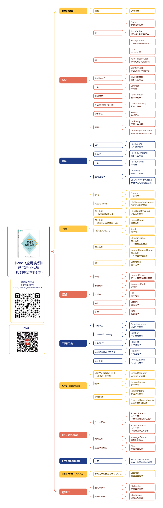
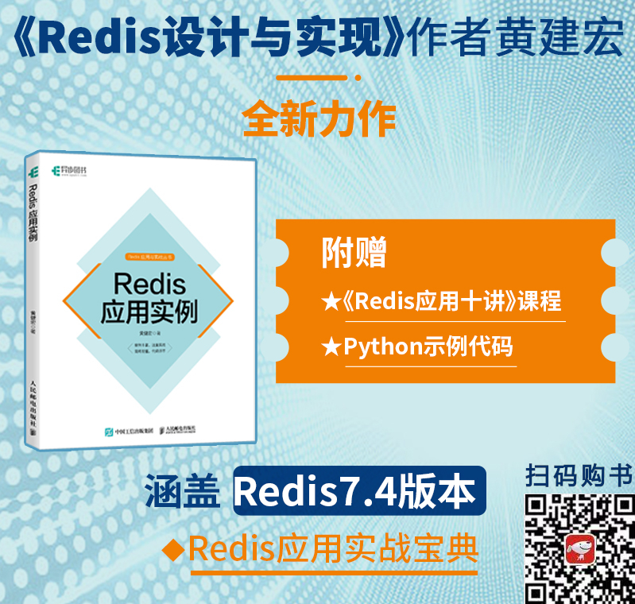

# 《Redis应用实例》随书示例代码

这个代码库展示的是《Redis应用实例》一书的随书示例代码，如果这些代码对你有帮助的话，欢迎通过购买图书来支持我的工作，谢谢！

关于《Redis应用实例》的更多信息请参考该书主页：[huangz.works/rediscookbook/](https://huangz.works/rediscookbook/)

软件需求：Python 3.12+，Redis 7.4+，redis-py 5.1.0b7+

| 章号 | 标题               | 代码及其描述                                                 |
| ---- | ------------------ | ------------------------------------------------------------ |
| 1    | 缓存文本数据       | [``Cache``](https://github.com/huangzworks/rediscookbook/blob/master/code/cache.py)——使用字符串实现的文本缓存程序 [``JsonCache``](https://github.com/huangzworks/rediscookbook/blob/master/code/json_cache.py)——使用字符串和JSON实现的多项数据缓存程序 [``HashCache``](https://github.com/huangzworks/rediscookbook/blob/master/code/hash_cache.py)——使用哈希实现的多项数据缓存程序 |
| 2    | 缓存二进制数据     | [``BinaryCache``](https://github.com/huangzworks/rediscookbook/blob/master/code/binary_cache.py)——使用字符串实现的二进制文件缓存程序 |
| 3    | 锁                 | [``Lock``](https://github.com/huangzworks/rediscookbook/blob/master/code/lock.py)——基本的锁（使用字符串实现） [``AutoReleaseLock``](https://github.com/huangzworks/rediscookbook/blob/master/code/auto_release_lock.py)——带自动释放功能的锁（使用字符串实现） |
| 4    | 带密码保护的锁     | [``IdentityLock``](https://github.com/huangzworks/rediscookbook/blob/master/code/identity_lock.py)——带密码保护功能的锁（使用字符串实现） |
| 5    | 自增数字ID         | [``IdGenerator``](https://github.com/huangzworks/rediscookbook/blob/master/code/id_generator.py)——使用字符串实现的ID生成器 [``HashIdGenerator``](https://github.com/huangzworks/rediscookbook/blob/master/code/hash_id_generator.py)——使用哈希实现的ID生成器 |
| 6    | 计数器             | [``Counter``](https://github.com/huangzworks/rediscookbook/blob/master/code/counter.py)——使用字符串实现的计数器 [``HashCounter``](https://github.com/huangzworks/rediscookbook/blob/master/code/hash_counter.py)——使用哈希实现的计数器 |
| 7    | 唯一计数器         | [``UniqueCounter``](https://github.com/huangzworks/rediscookbook/blob/master/code/unique_counter.py)——使用集合实现的唯一计数器 [``HllUniqueCounter``](https://github.com/huangzworks/rediscookbook/blob/master/code/hll_unique_counter.py)——使用HyperLogLog实现的唯一计数器 |
| 8    | 速率限制器         | [``RateLimiter``](https://github.com/huangzworks/rediscookbook/blob/master/code/rate_limiter.py)——速率限制器（使用字符串实现） |
| 9    | 二元操作记录器     | [``BinaryRecorder``](https://github.com/huangzworks/rediscookbook/blob/master/code/binary_recorder.py)——二元操作记录器（使用位图实现） |
| 10   | 资源池             | [``ResourcePool``](https://github.com/huangzworks/rediscookbook/blob/master/code/resource_pool.py)——资源池程序（使用集合实现） |
| 11   | 紧凑字符串         | [``CompactString``](https://github.com/huangzworks/rediscookbook/blob/master/code/compact_string.py)——紧凑字符串程序（使用字符串实现） |
| 12   | 数据库迭代器       | [``DbIterator``](https://github.com/huangzworks/rediscookbook/blob/master/code/db_iterator.py)——数据库迭代器程序（使用``SCAN``实现） [``DbSampler``](https://github.com/huangzworks/rediscookbook/blob/master/code/db_sampler.py)——迭代式数据库取样程序（使用``SCAN``和``TYPE``实现） [``random_key_generator()``](https://github.com/huangzworks/rediscookbook/blob/master/code/random_key_generator.py)——随机类型键生成器 |
| 13   | 流迭代器           | [``StreamIterator``](https://github.com/huangzworks/rediscookbook/blob/master/code/xrange_iterator.py)——使用``XRANGE``命令实现的流迭代器 [``StreamIterator``](https://github.com/huangzworks/rediscookbook/blob/master/code/xread_iterator.py)——使用``XREAD``命令实现的流迭代器 |
| 14   | 消息队列           | [``MessageQueue``](https://github.com/huangzworks/rediscookbook/blob/master/code/message_queue.py)——消息队列程序（使用流实现） [``Chat``](https://github.com/huangzworks/rediscookbook/blob/master/code/chat.py)——直播弹幕程序（使用流实现） |
| 15   | 标签系统           | [``Tag``](https://github.com/huangzworks/rediscookbook/blob/master/code/tag.py)——标签系统程序（使用集合实现） |
| 16   | 自动补全           | [``AutoComplete``](https://github.com/huangzworks/rediscookbook/blob/master/code/auto_complete.py)——自动补全程序（使用有序集合实现） |
| 17   | 抽奖               | [``Lottery``](https://github.com/huangzworks/rediscookbook/blob/master/code/lottery.py)——抽奖程序（使用集合实现） |
| 18   | 社交关系           | [``Relation``](https://github.com/huangzworks/rediscookbook/blob/master/code/relation.py)——社交关系程序（使用有序集合实现） |
| 19   | 登录会话           | [``Session``](https://github.com/huangzworks/rediscookbook/blob/master/code/session.py)——会话程序（使用字符串实现） |
| 20   | 短网址生成器       | [``UrlShorty``](https://github.com/huangzworks/rediscookbook/blob/master/code/url_shorty.py)——短网址生成器（使用字符串和哈希实现） [``UrlShortyWithCache``](https://github.com/huangzworks/rediscookbook/blob/master/code/url_shorty_with_cache.py)——带缓存的短网址生成器（使用字符串和哈希实现） [``base62()``](https://github.com/huangzworks/rediscookbook/blob/master/code/base62.py)——将数字从10进制转换为62进制的函数 |
| 21   | 投票               | [``Vote``](https://github.com/huangzworks/rediscookbook/blob/master/code/vote.py)——投票程序（使用集合实现） |
| 22   | 排行榜             | [``Ranking``](https://github.com/huangzworks/rediscookbook/blob/master/code/ranking.py)——排行榜程序（使用有序集合实现） |
| 23   | 分页               | [``Pagging``](https://github.com/huangzworks/rediscookbook/blob/master/code/pagging.py)——分页程序（使用列表实现） |
| 24   | 时间线             | [``Timeline``](https://github.com/huangzworks/rediscookbook/blob/master/code/timeline.py)——时间线程序（使用有序集合实现） |
| 25   | 地理位置           | [``Location``](https://github.com/huangzworks/rediscookbook/blob/master/code/location.py)——地理位置程序（使用地理位置索引实现） |
| 26   | 先进先出队列       | [``FifoQueue``](https://github.com/huangzworks/rediscookbook/blob/master/code/fifo_queue.py)、[``FifoQueueR``](https://github.com/huangzworks/rediscookbook/blob/master/code/fifo_queue_r.py)——先进先出队列（使用列表实现） |
| 27   | 定长队列和淘汰队列 | [``FixedLengthQueue``](https://github.com/huangzworks/rediscookbook/blob/master/code/fixed_length_queue.py)——定长队列（使用列表实现） [``FadedQueue``](https://github.com/huangzworks/rediscookbook/blob/master/code/faded_queue.py)——淘汰队列（使用列表实现） |
| 28   | 栈/后进先出队列    | [``Stack``](https://github.com/huangzworks/rediscookbook/blob/master/code/stack.py)——栈（使用列表实现） |
| 29   | 优先队列           | [``PriorityQueue``](https://github.com/huangzworks/rediscookbook/blob/master/code/priority_queue.py)——优先队列（使用有序集合实现） |
| 30   | 循环队列           | [``CircularQueue``](https://github.com/huangzworks/rediscookbook/blob/master/code/circular_queue.py)——循环队列（使用列表实现） [``UniqueCircularQueue``](https://github.com/huangzworks/rediscookbook/blob/master/code/unique_circular_queue.py)——无重复元素的循环队列（使用列表实现） |
| 31   | 矩阵               | [``ListMatrix``](https://github.com/huangzworks/rediscookbook/blob/master/code/list_matrix.py)——使用列表实现的矩阵程序 [``BitmapMatrix``](https://github.com/huangzworks/rediscookbook/blob/master/code/bitmap_matrix.py)——使用位图实现的矩阵程序 |
| 32   | 逻辑矩阵           | [``LogicalMatrix``](https://github.com/huangzworks/rediscookbook/blob/master/code/logical_matrix.py)——逻辑矩阵程序（使用位图实现） [``CompactLogicalMatrix``](https://github.com/huangzworks/rediscookbook/blob/master/code/compact_logical_matrix.py)——紧凑逻辑矩阵程序（使用位图实现） |

## 版权声明

版权所有©2024，黄健宏。

本项目中的代码受到版权和著作权保护，请勿在未授权的情况下在商业场景中使用本项目。

## 按数据结构分类程序

## 图书信息

